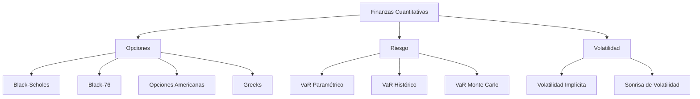

<p align="center">
  
</p>

<h1 align="center">
📈 Librería de Finanzas Cuantitativas
</h1>

<p align="center">
Implementación en Python de modelos para la valuación de derivados financieros,
análisis de riesgo y herramientas de finanzas cuantitativas.
</p>

<p align="center">


</p>

---

# 📖 Descripción

**Librería de Finanzas Cuantitativas** es un proyecto desarrollado en Python cuyo objetivo es proporcionar una colección de herramientas para la valuación de derivados financieros, el análisis de riesgo y la implementación de modelos clásicos utilizados en ingeniería financiera.

El proyecto está diseñado con una arquitectura modular y orientada a objetos, permitiendo utilizar los distintos modelos tanto con fines educativos como para aplicaciones prácticas de análisis cuantitativo.

Actualmente la librería incluye modelos de valuación para opciones europeas y americanas, cálculo de sensibilidades (Greeks), estimación de volatilidad implícita y métricas de riesgo como Value at Risk (VaR).

---

# ✨ Características

- ✅ Modelo Black-Scholes
- ✅ Modelo Black-76
- ✅ Opciones Europeas
- ✅ Opciones Americanas con dividendos discretos
- ✅ Letras Griegas (Delta, Gamma, Vega, Theta y Rho)
- ✅ Volatilidad implícita
- ✅ Sonrisa de volatilidad
- ✅ VaR Paramétrico
- ✅ VaR Histórico
- ✅ VaR Monte Carlo
- ✅ Arquitectura orientada a objetos
- ✅ Métodos numéricos mediante diferencias finitas

---

# 📂 Estructura del proyecto

```text
finanzas_cuantitativas/

│
├── opciones/
│   ├── clases.py
│   ├── precios.py
│   └── griegas.py
│
├── volatilidad/
│   └── volatilidad.py
│
├── riesgo/
│   └── riesgo.py
│
├── ejemplos/
│
├── imagenes/
│
└── README.md
```

---

# 📚 Modelos implementados

| Categoría | Implementación |
|------------|----------------|
| Opciones Europeas | Black-Scholes |
| Opciones Americanas | Aproximación de Black |
| Opciones sobre futuros | Black-76 |
| Dividendos discretos | ✔ |
| Greeks | Delta, Gamma, Vega, Theta y Rho |
| Riesgo | VaR Paramétrico, Histórico y Monte Carlo |
| Volatilidad | Implícita mediante Newton-Raphson y Bisección |

---

# 🚀 Ejemplo de uso

```python
from finanzas_cuantitativas.opciones import OpcionEuropea

call = OpcionEuropea(
    s0=100,
    k=95,
    t=6/12,
    r=0.08,
    sigma=0.25
)

print("Precio:", call.precio_bs())
print("Delta :", call.delta)
print("Gamma :", call.gamma)
print("Vega  :", call.vega)
print("Theta :", call.theta)
```

---

# 📊 Arquitectura



---

# 📈 Ejemplos

## Sonrisa de volatilidad

<p align="center">

</p>

---

## Sensibilidades (Greeks)

<p align="center">

</p>

---

# 🧠 Métodos Numéricos

La librería implementa tanto soluciones analíticas como métodos numéricos para la valuación y análisis de derivados.

Entre ellos se encuentran:

- Diferencias finitas
- Newton-Raphson
- Método de Bisección
- Simulación Monte Carlo

---

# 📌 Aplicaciones

La librería puede utilizarse para:

- Ingeniería Financiera.
- Finanzas Cuantitativas.
- Gestión de Riesgo.
- Modelado de Derivados.
- Cursos universitarios.
- Investigación.
- Desarrollo de estrategias de cobertura.

---

# 🛣 Roadmap

## ✔ Implementado

- [x] Black-Scholes
- [x] Black-76
- [x] Greeks
- [x] Dividendos discretos
- [x] VaR
- [x] Volatilidad Implícita
- [x] Sonrisa de Volatilidad

## 🚧 En desarrollo

- [ ] Árboles Binomiales (CRR)
- [ ] Barone-Adesi & Whaley
- [ ] Bjerksund-Stensland
- [ ] Monte Carlo para Opciones
- [ ] Opciones Exóticas
- [ ] Superficie de Volatilidad
- [ ] Optimización de Portafolios (Markowitz)
- [ ] Cálculo de volatilidad histórica

---

# 📄 Licencia

Este proyecto se distribuye bajo la licencia **MIT**.

Consulta el archivo **LICENSE** para más información.

---

# 👨‍💻 Autor

**Jerson Gallardo**

Matemático Algorítmico — Escuela Superior de Física y Matemáticas (ESFM-IPN)

Intereses:

- Finanzas Cuantitativas
- Machine Learning
- Deep Learning
- Modelado Matemático
- Derivados Financieros

GitHub:

https://github.com/TU_USUARIO

LinkedIn:

https://www.linkedin.com/in/TU_LINKEDIN/

---

<p align="center">

⭐ Si este proyecto te resulta útil, considera darle una estrella al repositorio.

</p>