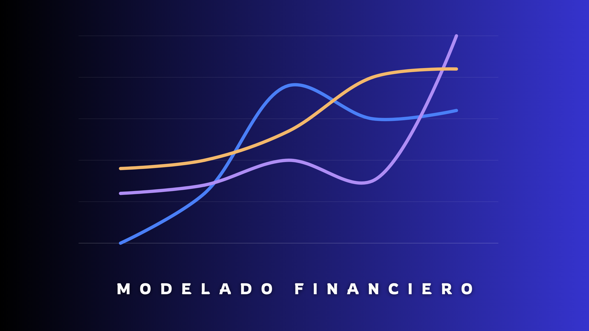
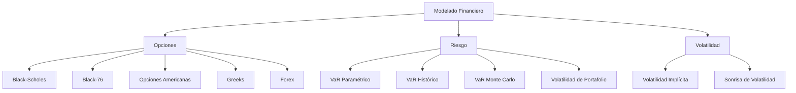
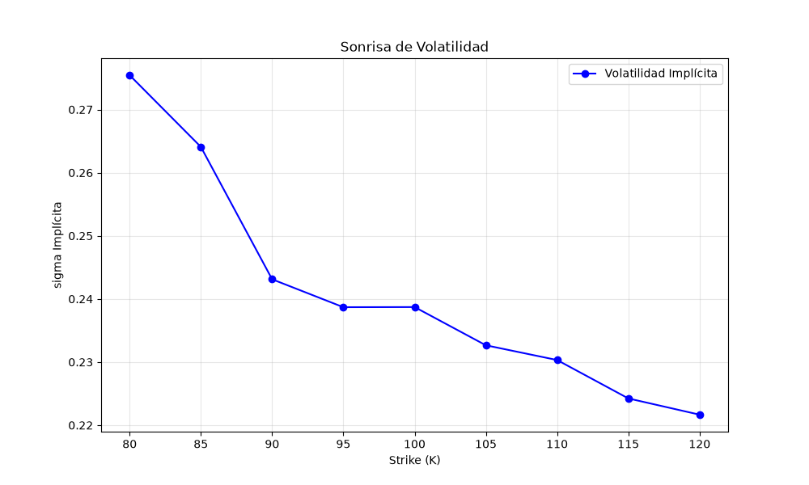

<p align="center">
  
</p>

<h1 align="center">
📈 Librería de Finanzas Cuantitativas
</h1>

<p align="center">
Biblioteca de Python para modelado financiero cuantitativo, valuación de derivados, estimación de volatilidad implícita y análisis de riesgo.
</p>

<p align="center">


</p>

---

# 📖 Descripción

**Librería de Finanzas Cuantitativas** es una biblioteca desarrollada en Python cuyo objetivo es proporcionar herramientas para la valuación de derivados financieros, el análisis de riesgo y la implementación de modelos clásicos utilizados en finanzas cuantitativas.

Incluye implementaciones de modelos ampliamente utilizados en la industria y en entornos académicos, permitiendo tanto el aprendizaje de conceptos fundamentales como la construcción de aplicaciones cuantitativas más avanzadas.

Actualmente la librería incorpora modelos para opciones sobre acciones, futuros y divisas, cálculo de sensibilidades (Greeks), estimación de volatilidad implícita y métricas de riesgo como Value at Risk (VaR).

---

# 📦 Instalación

Instalación directa desde GitHub:

```bash
pip install git+https://github.com/Hertzz729/Modelado-Financiero.git
```

Una vez instalada, la librería puede importarse mediante:

```python
from modelado_financiero import OpcionEuropea
```

---

# ∪･ｪ･∪ Inicio Rápido

```python
from modelado_financiero import OpcionEuropea

opcion = OpcionEuropea(
    s0=100,
    k=100,
    t=6/12,
    r=0.05,
    sigma=0.20
)

print("Precio Call:", opcion.precio("call"))
print("Delta:", opcion.delta("call"))
print("Gamma:", opcion.gamma())
print("Vega :", opcion.vega())
```

Para ejemplos más completos consulta la carpeta:

```text
Ejemplos_de_Uso/
```

---

# ✨ Características

## Derivados Financieros

- ✅ Modelo Black-Scholes
- ✅ Modelo Black-76
- ✅ Modelo de Garman-Kohlhagen (Forex)
- ✅ Opciones Europeas
- ✅ Opciones Europeas con Dividendos Discretos
- ✅ Opciones Americanas con Dividendos Discretos
- ✅ Letras Griegas (Delta, Gamma, Theta, Vega y Rho)

## Volatilidad

- ✅ Volatilidad Implícita
- ✅ Método de Newton-Raphson
- ✅ Método de la Secante
- ✅ Método de Bisección
- ✅ Sonrisa de Volatilidad

## Gestión de Riesgo

- ✅ Volatilidad de Portafolio
- ✅ VaR Paramétrico
- ✅ VaR Histórico
- ✅ VaR Monte Carlo

## Arquitectura

- ✅ Orientada a Objetos
- ✅ API Funcional
- ✅ Compatible con NumPy
- ✅ Compatible con Google Colab

---

# 📂 Estructura del Proyecto

```text
modelado_financiero/

├── opciones/
│   ├── clases_opciones.py
│   ├── precios.py
│   └── griegas.py
│
├── volatilidad/
│   └── volatilidad.py
│
├── riesgo/
│   └── riesgo.py
│
├── Ejemplos_de_Uso/
│
├── imagenes/
│
└── README.md
```

---

# 📚 Modelos Implementados

| Categoría | Modelo |
|------------|------------|
| Opciones Europeas | Black-Scholes |
| Opciones Europeas con Dividendos | Black-Scholes Ajustado |
| Opciones sobre Futuros | Black-76 |
| Opciones Forex | Garman-Kohlhagen |
| Opciones Americanas con Dividendos | Aproximación de Black |
| Greeks | Delta, Gamma, Theta, Vega y Rho |
| Volatilidad Implícita | Newton-Raphson |
| Volatilidad Implícita | Secante |
| Volatilidad Implícita | Bisección |
| Riesgo | VaR Paramétrico |
| Riesgo | VaR Histórico |
| Riesgo | VaR Monte Carlo |
| Portafolios | Volatilidad de Portafolio |

---

# 🔧 API Pública

## Opciones

```python
from modelado_financiero import (
    OpcionEuropea,
    OpcionEuropeaDiv,
    OpcionAmericanaDiv,
    OpcionFuturos,
    OpcionForex
)
```

## Riesgo

```python
from modelado_financiero import (
    Vol_portafolio,
    VaR_parametrico,
    VaR_historico,
    VaR_montecarlo
)
```

## Volatilidad

```python
from modelado_financiero import (
    estimacion_sigma_Newton,
    estimacion_sigma_tangente,
    estimacion_sigma_biseccion,
    sonrisa_volatilidad
)
```

---

# 📊 Arquitectura



---

# 📈 Ejemplos

## Sonrisa de Volatilidad

<p align="center">

</p>


---

# 	(｡•̀ᴗ-)✧ Métodos Numéricos

La librería implementa tanto soluciones analíticas como métodos numéricos utilizados en finanzas cuantitativas.

Entre ellos se encuentran:

- Diferencias Finitas
- Newton-Raphson
- Método de la Secante
- Método de Bisección
- Simulación Monte Carlo

---

# 🎯 Objetivo del Proyecto

El objetivo de esta biblioteca es proporcionar implementaciones claras, documentadas y reproducibles de los modelos clásicos utilizados en finanzas cuantitativas.

La librería está orientada tanto a estudiantes de ingeniería financiera, matemáticas aplicadas, ciencias actuariales y economía cuantitativa, como a profesionales que requieran herramientas ligeras para análisis cuantitativo, validación de modelos y desarrollo de aplicaciones financieras.

---

# 📌 Aplicaciones

La librería puede utilizarse para:

- Ingeniería Financiera
- Finanzas Cuantitativas
- Gestión de Riesgo
- Modelado de Derivados
- Cursos Universitarios
- Investigación
- Desarrollo de Estrategias de Cobertura
- Aprendizaje de Métodos Numéricos Aplicados a Finanzas

---

# 📚 Referencias

Los modelos implementados están basados principalmente en:

- Black, F. & Scholes, M. (1973)
- Merton, R. C. (1973)
- Black, F. (1976)
- Garman, M. & Kohlhagen, S. (1983)
- Hull, J. C. — *Options, Futures and Other Derivatives*
- McDonald, R. — *Derivatives Markets*

---

# ( ˘▽˘)っ♨  Estado del Proyecto

La biblioteca se encuentra en desarrollo activo.

**Versión actual:** 0.1.0

Las funcionalidades principales de valuación de derivados, volatilidad implícita y gestión de riesgo ya se encuentran operativas y documentadas. Nuevos modelos y herramientas serán incorporados progresivamente.

---

# 🛣 Roadmap

## ✔ Implementado

- [x] Black-Scholes
- [x] Black-76
- [x] Garman-Kohlhagen
- [x] Greeks
- [x] Dividendos Discretos
- [x] VaR Paramétrico
- [x] VaR Histórico
- [x] VaR Monte Carlo
- [x] Volatilidad Implícita
- [x] Sonrisa de Volatilidad

## 🚧 En Desarrollo

- [ ] Exposición pública del modelo Binomial CRR
- [ ] Barone-Adesi & Whaley
- [ ] Bjerksund-Stensland
- [ ] Monte Carlo para Opciones
- [ ] Opciones Exóticas
- [ ] Superficie de Volatilidad
- [ ] Optimización de Portafolios (Markowitz)
- [ ] Cálculo de Volatilidad Histórica
- [ ] Tests Automáticos
- [ ] Publicación en PyPI

---

# 📄 Licencia

Este proyecto se distribuye bajo la licencia **MIT**.

Consulta el archivo **LICENSE** para más información.

---

# 👨‍🌾 Autor

**Jerson Gallardo**

Matemático Algorítmico  
Escuela Superior de Física y Matemáticas (ESFM-IPN)

### Áreas de interés

- Finanzas Cuantitativas
- Machine Learning
- Deep Learning
- Modelado Matemático
- Derivados Financieros

### GitHub

https://github.com/Hertzz729

---

<p align="center">

⭐ Si este proyecto te resulta útil, considera darle una estrella al repositorio.

</p>